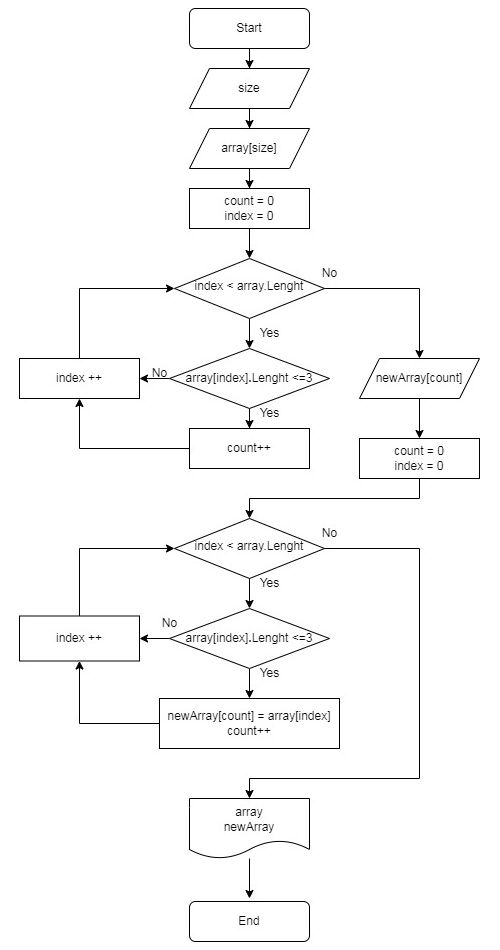

# Итоговая контрольная работа по основному блоку
### _Задание:_ Написать программу, которая из имеющегося массива строк формирует новый массив из строк, длина которых меньше, либо равна 3 символам. Первоначальный массив можно ввести с клавиатуры, либо задать на старте выполнения алгоритма. При решении не рекомендуется пользоваться коллекциями, лучше обойтись исключительно массивами.
---
### Контрольная работа выполнена на языке C#

В программе запрашиваем от пользователя размерность исходного массива.
Создаём массив и заполняем его значениями в цикле через ввод с клавиатуры.

Выводим содержимое исходного массива.

Для определения размерности нового массива считаем сколько в исходном массиве элементов, удовлетворяющих условию.

Создаем новый массив полученной размерности и заполняем его элементами из исходного массива.

Выводим содержимое нового массива.

### В отдельные методы вынесено: 
+ запрос размерности исходного массива
+ построчное заполнение исходного массива пользователем
+ определение количества элементов, удовлетворяющих условию в исходном массиве
+ заполнение нового массива из исходного массива
+ вывод массива


## код программы:
```C#
int ReadInt(string message)
{
    Console.Write(message + " ");
    return Convert.ToInt32(Console.ReadLine());
}

void ReadArray(string[] ArrayForRead)
{
    Console.WriteLine("Строк для ввода " + ArrayForRead.Length);
    for (int i = 0; i < ArrayForRead.Length; i++)
    {
        Console.Write((i + 1) + ": ");
        ArrayForRead[i] = Console.ReadLine();
    }
}

void PrintArray(string[] ArrayForPrint, string separator = ", ")
{
    Console.WriteLine($"[{string.Join(separator, ArrayForPrint)}]");
}

int SizeNewArray(string[] ArraySourse)
{
    int count = 0;
    for (int i = 0; i < ArraySourse.Length; i++)
    {
        if (ArraySourse[i].Length <= 3) count++;
    }
    return count;
}

void FillNewArray(string[] ArraySourse, string[] ArrayForFill)
{
    int count = 0;
    for (int i = 0; i < ArraySourse.Length; i++)
    {
        if (ArraySourse[i].Length <= 3)
        {
            ArrayForFill[count] = ArraySourse[i];
            count++;
        }

    }
}

//=============================================
int size = ReadInt("Введите размер массива: ");

string[] arrayOfString = new string[size];

ReadArray(arrayOfString);

Console.Write("Исходный массив: ");
PrintArray(arrayOfString, ", ");

string[] newArrayOfString = new string[SizeNewArray(arrayOfString)];

FillNewArray(arrayOfString, newArrayOfString);

Console.Write("Новый массив: ");
PrintArray(newArrayOfString);
```
> в место функции SizeNewArray можно было использовать конструкцию: 
```
array.Count(s => s.Length <= 3)
```
## Пример выполнения программы:
```
Введите размер массива:  7
Строк для ввода 7
1: мир
2: да
3: планета
4: 1
5: test
6: C#
7: программа
Исходный массив: [мир, да, планета, 1, test, C#, программа]
Новый массив: [мир, да, 1, C#]
```

## Блок-схема алгоритма
 

